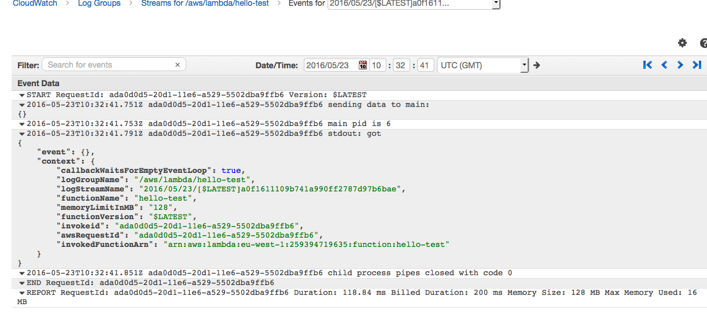

# Running Haskell AWS Lambda Functions

This repository contains code and directions to run Haskell executables over [AWS Lambda]() "serverless" infrastructure. This experiment was triggered by reading description of [apex](http://apex.run) provide a wrapper to run Go code.

## Getting started

* Ensure access to AWS Lambda service:
    * use `aws configure` to define credentials and region to deploy to
    * create or use role for executing code on AWS Lambda
* Build docker container for building Haskell code that is supposed to be runnable on Amazon's Linux AMI
    
    ```
    cd ghc-centos
    docker build -t haskell-centos .
    cd ..
    ```

* Build haskell code:

    ```
    docker run -ti -v $(pwd):/build -w /build --name=haskell-build haskell-centos stack build --allow-different-user
    ...
    CONTAINER_ID=$(docker ps -a | grep haskell-centos | head -1 | cut -d ' ' -f 1)
    docker run --volumes-from=$CONTAINER_ID busybox dd if=/build/.stack-work/install/x86_64-linux/ghc-7.10.3/7.10.3/bin/main > main
    ```

* Build zip file containing Javascript wrapper and main app
  
  ```
  zip lambda.zip run.js main
  ```
  
* Create function on Lambda:

    ```
    $ aws lambda create-function --function-name hello-test --runtime nodejs4.3 --zip-file fileb://./aws-lambda.zip  --handler run.handle --role arn:aws:iam::259394719635:role/lambda
    {
        "CodeSha256": "QYKOebaDN/fqEzb1nmaV3ByNDZK3JvD0kWX6YQnPpjE=", 
        "FunctionName": "hello-test", 
        "CodeSize": 265356, 
        "MemorySize": 128, 
        "FunctionArn": "arn:aws:lambda:eu-west-1:259394719635:function:hello-test", 
        "Version": "$LATEST", 
        "Role": "arn:aws:iam::259394719635:role/lambda", 
        "Timeout": 20, 
        "LastModified": "2016-05-23T10:32:38.126+0000", 
        "Handler": "run.handle", 
        "Runtime": "nodejs4.3", 
        "Description": ""
    }
    ```

* Run function on Lambda:

    ```
    $ aws lamdba invoke-function --function-name hello-test
    {
        "StatusCode": 200
    }
    $ cat test
    "child process exited with code 0"
    ```

The provided `main.hs` simply output its input to its output. There should be an execution trace in the logs hosted on CloudWatch:


    
## Manifest

* `ghc-centos`: Docker container for building Haskell binaries compatible with [Amazon's Linux AMI](http://docs.aws.amazon.com/lambda/latest/dg/current-supported-versions.html). Does not seem to be a good idea in general as there are quite a few differences between CentOS and Linux AMI.
* `run.js`: Javascript wrapper to run binary in a child process
* `test.js`: Javascript test wrapper, invoke the handler simulating what AWS Lambda does
* `stack.yaml`, `main.cabal`, `main.hs`: Basic structure for building Haskell code

## References

* [Running executables in AWS Lambda](http://aws.amazon.com/fr/blogs/compute/running-executables-in-aws-lambda/)
* [Child processes in node](https://nodejs.org/api/child_process.html)
* [AWS Lambda documentation](http://docs.aws.amazon.com/lambda/latest/dg/nodejs-create-deployment-pkg.html)
